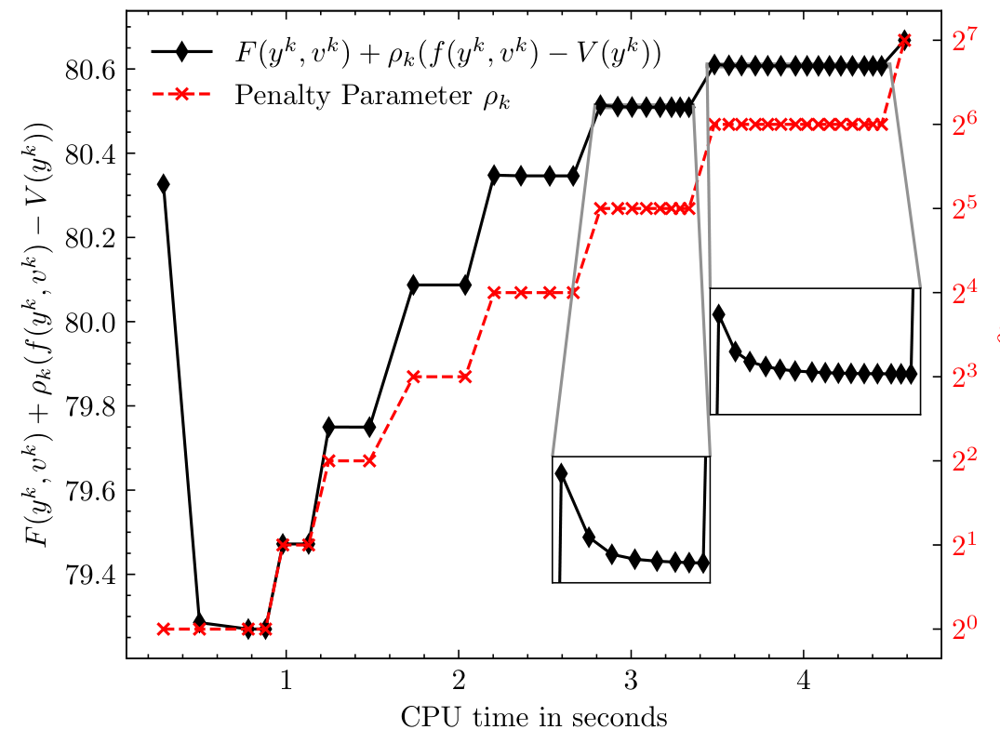
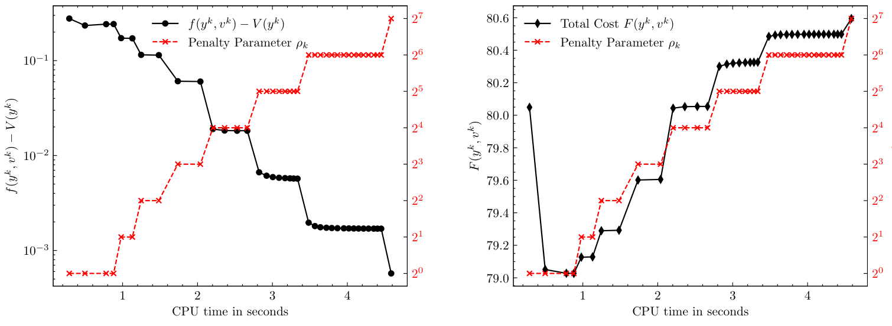
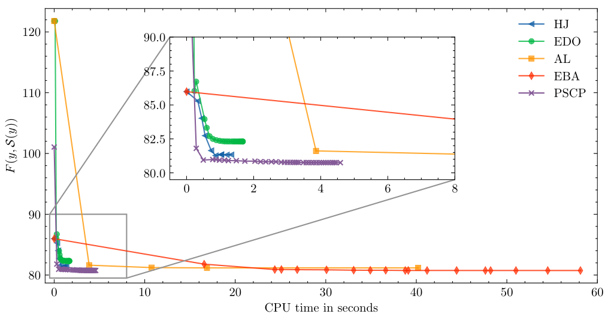
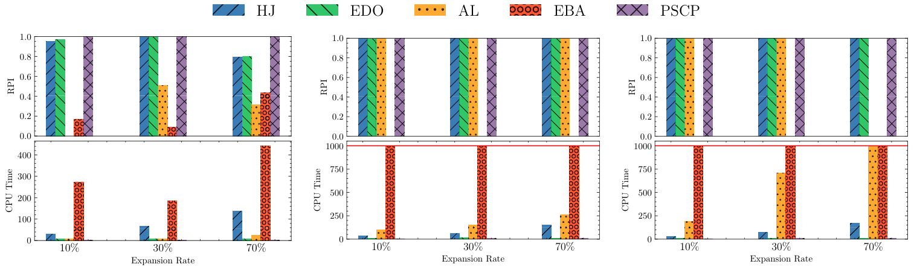
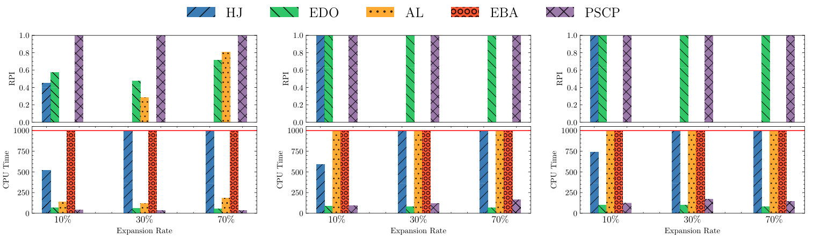
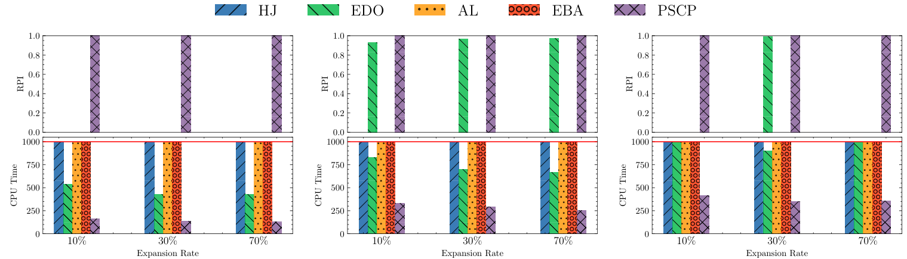

[](https://pubsonline.informs.org/journal/ijoc)

# A penalized sequential convex programming approach for continuous network design problems

This archive is distributed in association with the [INFORMS Journal on
Computing](https://pubsonline.informs.org/journal/ijoc) under the [MIT License](LICENSE).

The software and data in this repository are a snapshot of the software and data
that were used in the research reported on in the paper 
[This is a Template](https://doi.org/10.1287/ijoc.2019.0000) by L. Guo, H. Yin and J. Zhang. 


## Cite

To cite the contents of this repository, please cite both the paper and this repo, using their respective DOIs.

https://doi.org/10.1287/ijoc.2025.0000

https://doi.org/10.1287/ijoc.2025.0000.cd

Below is the BibTex for citing this snapshot of the repository.

```
@misc{guo2025penalized,
  author =        {Lei Guo and Haian Yin and Jin Zhang},
  publisher =     {INFORMS Journal on Computing},
  title =         {{A penalized sequential convex programming approach for continuous network design problems}},
  year =          {2025},
  doi =           {10.1287/ijoc.2025.0000.cd},
  url =           {https://github.com/INFORMSJoC/2025.0000},
  note =          {Available for download at https://github.com/INFORMSJoC/2025.0000},
}  
```

## Description

This repository contains the software and data used in the paper *A Penalized Sequential Convex Programming Approach for Continuous Network Design Problems*. The primary goal of this work is to propose and evaluate a novel approach to solving continuous network design problems (**CNDP**), specifically through a penalized sequential convex programming method.

The software demonstrates how the proposed optimization algorithm (**PSCP**) can be applied to CNDP, showcasing its high computational efficiency and solution quality. This repository includes the experimental setup and data necessary to replicate the experiments presented in the paper.

By using this code, users can explore various aspects of network design optimization, evaluate the proposed method, and compare it with other solution strategies.

## Building

The code for the experiments in this repository is based on [Julia](https://github.com/JuliaLang/julia) 10.4.

The required dependencies are listed in the folder `scripts/CNDP`. To quickly set up the environment, follow these steps:

```
1. Download and install Julia 10.4.
2. Open Julia in the `scripts` directory.
3. Press `]` to enter the REPL package mode.
4. Run the command `activate CNDP` to activate the environment.
5. Run the command `instantiate` to ensure all dependencies are installed and ready to use.
```

Alternatively, you can manually install the dependencies for a different version of Julia if preferred.


## Results

### Behavior of the CNDP

Figure 1: Variation of penalty function values over computational time on Sioux Falls

<p align = "center">    

</p>

Figure 2 : Variation of total cost and constraint violation over computational time on Sioux Falls


### Performance of the CNDP Compared to Other Algorithms on Sioux Falls

Figure 3: Comparison of the convergence of different methods on SiouxFall network
<p align = "center">    

</p>

### Performance of the CNDP Compared to Other Algorithms on Large-Scale Problems

Figure 4: Numerical comparison on Anaheim with different traffic demands and expansion rates


Figure 5: Numerical comparison on Barcelona with different traffic demands and expansion rates


Figure 6: Numerical comparison on Chicago-Sketch with different traffic demands and expansion rates



## Replicating

To replicate the results in [Figure 1](results/Figure1) and [Figure 2](results/Figure2), run 

```
julia demo.jl
```

To replicate the results in [Figure 3](results/Figure3), run 

```
julia main_SiouxFalls.jl
```

To replicate the results in [Figure 4](results/Figure4)/[Figure 5](results/Figure5)/[Figure 6](results/Figure6) , run 

```
bash runner.sh
julia NRMFD_EBA_CNDP.jl
```

Note: These commands will generate the corresponding **data** outputs for the figures. However, the plots themselves are **not** automatically generated and will need to be analyzed and visualized separately using your preferred plotting tools.